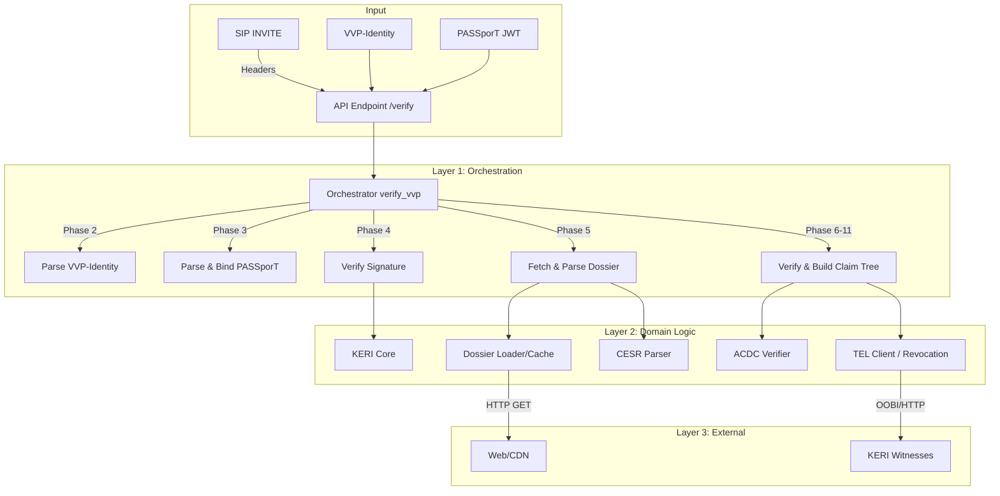

# VVP Verifier System Overview

## 1. System Abstract
The VVP Verifier is a Python-based FastAPI application designed to validate Verifiable Voice Protocol (VVP) claims in VoIP calls. It acts as a bridge between traditional SIP signaling (STIR/SHAKEN PASSporTs) and decentralized identity infrastructure (KERI/ACDC dossiers). The system determines if a caller is authorized to use a specific telephone number by verifying a chain of cryptographic evidence rooted in a Trusted Root (e.g., GLEIF or a QVI).

## 2. High-Level Architecture

The verification process is a linear pipeline orchestrated by the `verify_vvp` function, transforming raw inputs into a hierarchical Claim Tree.

## 3. Code Component Mapping

The architecture maps to the codebase as follows:

| component_name | description | primary_files |
| :--- | :--- | :--- |
| **Orchestrator** | Manages the verification pipeline and claim tree construction. | `app/vvp/verify.py` |
| **Dossier Model** | Handles fetching, parsing binary CESR, and graph validation. | `app/vvp/dossier/parser.py` `app/vvp/dossier/validator.py` `app/vvp/keri/cesr.py` |
| **Credential Logic** | Implements ACDC semantic verification and schema rules. | `app/vvp/acdc/verifier.py` `app/vvp/acdc/acdc.py` |
| **Revocation (TEL)** | Checks credential status against Transaction Event Logs. | `app/vvp/keri/tel_client.py` |
| **API Interface** | HTTP entry points and Request/Response models. | `app/main.py` `app/vvp/api_models.py` |

---

## 4. Component Analysis: Dossier Parsing & Model

This layer is responsible for ingesting potentially complex binary streams and converting them into a validated Directed Acyclic Graph (DAG) of credentials.

### parser.py & cesr.py
The parsing logic operates in two modes to handle the diversity of deployment environments.

#### Algorithm: CESR Stream Parsing
The system implements a subset of CESR v1.0 (Composable Event Streaming Representation). It processes streams by reading **Count Codes** which dictate the type and length of the following data.

1.  **Detection**: `_is_cesr_stream` checks for the version markers (`-_AAA`) or count codes at the start of the data.
2.  **Strict Parsing**: `cesr.parse_cesr_stream` iterates through the bytes:
    *   **JSON Events**: Identified by leading `{`, parsed by finding the matching closing `}`.
    *   **Count Codes**: Read to determine attachment type (e.g., `-A` for Controller Signatures, `-V` for Attachment Groups). Use lookup tables (`COUNT_CODE_SIZES`, `SIGNATURE_SIZES`) to safely slice binary data.
    *   **Attachments**: Signatures are extracted and mapped to the preceding JSON event (ACDC).
3.  **Permissive Fallback**: If strict parsing fails (e.g., unknown attachment types from newer KERI versions), `_extract_json_events_permissive` is used. It scans for balanced `{}` braces to extract JSON objects, discarding the binary attachments. This ensures forward compatibility for reading the *content* of credentials even if the *proofs* are in a newer format.

### validator.py
Once parsed into `ACDCNode` objects, the `build_dag` function assembles them into a graph structure managed by the `DossierDAG` class.

*   **Cycle Detection**: A Depth-First Search (DFS) using 3-color marking (White/Gray/Black) checks for back-edges to active nodes (Gray) to detect cycles.
*   **Root Finding**: Enforces that the dossier has exactly one root (node with no incoming edges) unless `allow_aggregate` is enabled.
*   **ToIP Compliance**: `_collect_toip_warnings` runs a suite of non-blocking checks against the ToIP Verifiable Dossiers specification (e.g., verifying that evidence is in the `e` block, not the `a` block).

---

## 5. Component Analysis: Verification Logic

This layer applies semantic meaning to the raw DAG, validating that the credentials form a compliant chain of authority.

### models.py
The `ACDC` dataclass represents a parsed credential.
*   **Variant Support**: Explicitly tracks "full", "compact", and "partial" variants (per VVP §1.4). Compact variants (where attributes are a SAID reference) play a key role in the "Indeterminate" status logic.
*   **Type Inference**: The `credential_type` property infers the type (APE, DE, TNAlloc) based on schema SAIDs (primary) or edge names (heuristic fallback).

### verifier.py
This module implements the core VVP trust logic.

#### Algorithm: Recursive Chain Validation
The `validate_credential_chain` function performs a recursive walk from the leaf credential (e.g., the APE authorizing the call) up to a Trusted Root (GLEIF or QVI).

1.  **Depth Control**: Enforces `max_depth` to prevent infinite loops.
2.  **Semantic Rules**: Applies `EDGE_RULES` based on credential type:
    *   **APE**: Must have a `vetting` edge pointing to an LE credential.
    *   **DE**: Must have a `delegation` edge pointing to a delegating APE/DE.
    *   **TNAlloc**: Should have a `jurisdiction` (`jl`) edge to a parent allocator.
3.  **Governance**: Validates that all credentials use official vLEI schema SAIDs using `validate_schema_said`.
4.  **Issuee Binding**: Enforces that credentials are not bearer tokens; they must nominally bind to an issuee (except root anchors).
5.  **External Resolution**: If an edge points to a SAID not in the dossier, it attempts to resolve it via `credential_resolver` (querying witnesses).
    *   **Indeterminate State**: If an external reference cannot be resolved (especially in compact variants), the chain status becomes `INDETERMINATE` rather than `INVALID`, adhering to the "Explicit Uncertainty" principle.

---

## 6. Component Analysis: Revocation (TEL)

This component interacts with the KERI Transaction Event Log (TEL) to determine the lifecycle status of a credential.

### tel_client.py
The `TELClient` provides a lightweight mechanism to query state without a full KERI node installation.

#### Revocation Check Strategy
The system employs a multi-layered strategy to resolve credential status:

1.  **Inline TEL (Fast Path)**: Checks if TEL events (`iss`, `rev`, `bis`, `brv`) are embedded directly in the dossier stream. This allows for self-contained proofs where the dossier carries its own revocation evidence.
2.  **OOBI Resolution**: If the credential has a Registry ID (`ri`), it constructs an OOBI URL to query the registry's witnesses directly.
3.  **Witness Pool**: Falls back to querying a configured pool of high-availability witnesses if OOBI resolution fails.

#### Status Logic
The client parses the event stream for a specific credential SAID:
*   **ACTIVE**: Latest event is Issuance (`iss`, `bis`).
*   **REVOKED**: Latest event is Revocation (`rev`, `brv`).
*   **UNKNOWN**: No events found (or network/witness errors).

---

## 7. Data Flow: The Journey of a Dossier

Tracing the lifecycle of a VVP verification request from bit-stream to verified status:

1.  **Ingest**: The `verify_vvp` orchestrator receives the PASSporT and extracts the `kid` (Key ID), which resolves to an OOBI URL.
2.  **Signature Verification (Tier 2)**: The system resolves the signer's Key Event Log (KEL) via the OOBI to verify the PASSporT signature against the current key state.
3.  **Fetch**: The dossier is fetched from the Evidence URL (`evd`) claim in the PASSporT.
4.  **Parse & DAG**:
    *   The `parser` detects if the dossier is CESR or JSON.
    *   If CESR, it slices the binary stream to finding signed ACDC regions.
    *   The `validator` builds the DAG, detecting cycles and ensuring a single root.
5.  **Verify Chain**:
    *   The `verifier` walks from leaf to root.
    *   It checks semantic edge rules (APE->LE, DE->APE).
    *   It strictly matches schema SAIDs against the vLEI governance framework.
6.  **Check Revocation**:
    *   The `tel_client` is invoked for every credential in the chain.
    *   It checks for inline revocation data first, then queries the network.
7.  **Result**:
    *   If any check fails definitively (e.g., bad sig, revoked), the status is **INVALID**.
    *   If checks fail due to uncertainty (e.g., unreachable witness, compact variant missing target), status is **INDETERMINATE**.
    *   Otherwise, status is **VALID**.

